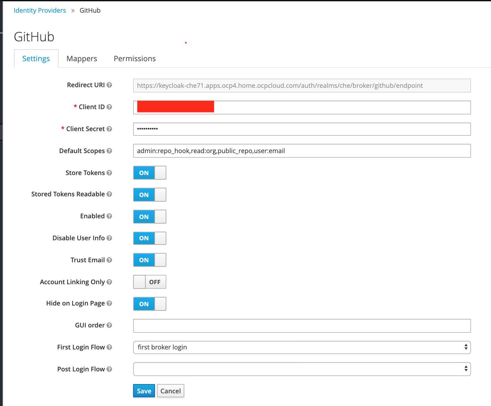
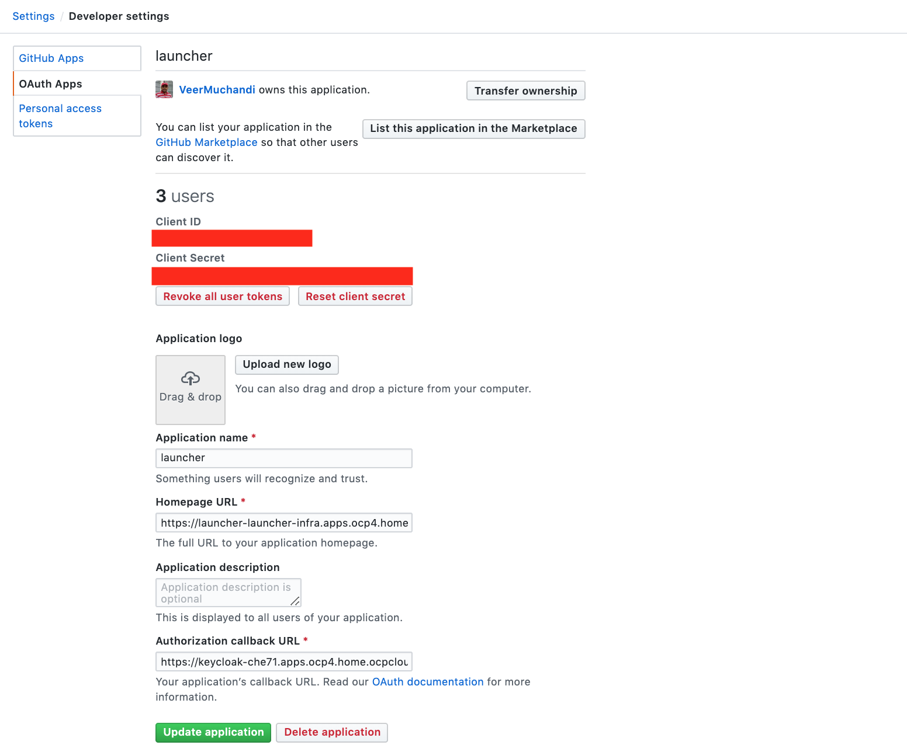
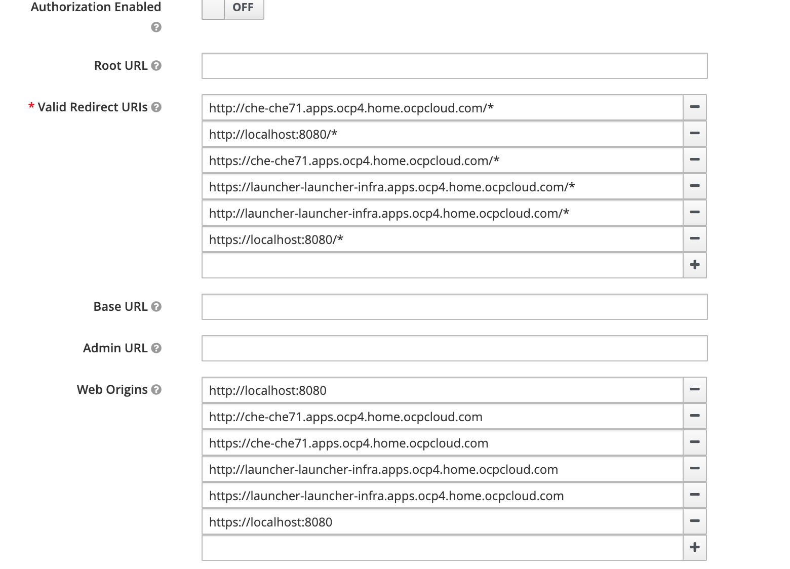

# Integrating Launcher with Keycloak installed by CRW

## Install EclipseChe 7.1

Install Eclipse Che7.1 on your OCP4 cluster following the documentation explained here
[https://www.eclipse.org/che/docs/che-7/installing-che-on-openshift-4-from-operatorhub/](https://www.eclipse.org/che/docs/che-7/installing-che-on-openshift-4-from-operatorhub/)

>**Note** Once CRW2.x is released we will replace EclipseChe7.x with CRW in the above step.

Note also enable SSL as explained here [https://www.eclipse.org/che/docs/che-7/installing-che-on-openshift-4-from-operatorhub/#enabling-ssl-on-openshift-4_installing-che-on-openshift-4-from-operatorhub](https://www.eclipse.org/che/docs/che-7/installing-che-on-openshift-4-from-operatorhub/#enabling-ssl-on-openshift-4_installing-che-on-openshift-4-from-operatorhub)

Most likely you are using a self-signed certificates.  IDE gets stuck several times due to these self-signed certificates. There are two ways to deal with this issue:

1.   Look at the developer console in your browser to figure out which URLs are failing, access those URLS, go to advanced and agree to move forward with that URL. You may have to do this multiple times for different URLs (such as plugin registry, devfile registry, keycloak etc)
2. Easier way is to add the self-signed certificate as a trusted cert as explained here [https://www.accuweaver.com/2014/09/19/make-chrome-accept-a-self-signed-certificate-on-osx/](https://www.accuweaver.com/2014/09/19/make-chrome-accept-a-self-signed-certificate-on-osx/)

### Keycloak Setup

EclipseChe 7.x installation above also installs Keycloak Server.

#### Add Github Identity Provider
Login to the KeyCloak admin console. 
You can find the keycloak URL associated with the route in the namespace where Che 7.x was installed. You can find it by running `oc get route keycloak -o jsonpath='{.spec.host}'`

For the admin password, check the environment variables in the `Deployment` for Keycloak. You can find it by running `oc get deployment keycloak -o yaml | grep -A1 KEYCLOAK_PASSWORD`

Navigate to `Identity Providers` on the left menu. You will see  `openshift-v4` identity provider already existing. This means your keycloak is already integrated with the authentication mechanism configured for your openshift cluster.

Let us now add a new identity provider for `github`. 
* Press on `Add Provider` and select `github` provider

* Configure github provider as shown in the following figure. Note the value of `Redirect URI`




* To fill the values for `Client ID` and `Client Secret` above, login to your Github account, go to `Settings` and `Developer Settings`.  Then add an `OAuth App` let us say with the name `launcher` as shown in the screen below. This will generate a `Client Id` and `Client Secret` that you can use to configure Github Identity provider in Keycloak. Make sure you set the `Authorization Callback URL` to the `Redirect URI` noted above.




You can set the `HomePage URL` to some temporary URL and later come back and update it to Launcher's URL if you wish.


## Install Fabric8 Launcher

### Deploy Launcher Operator

> **NOTE:** Launcher Operator is not yet part of OperatorHub. So we have to deploy launcher operator manually

Clone the launcher code from its git repo
```
$ git clone https://github.com/fabric8-launcher/launcher-operator
$ cd launcher-operator
```

Create a new project on your openshift cluster for launcher

```
$ oc new-project launcher-infra
```

Deploy Launcher Operator

```
$ oc create -R -f ./deploy

customresourcedefinition.apiextensions.k8s.io/launchers.launcher.fabric8.io created
deployment.apps/launcher-operator created
role.rbac.authorization.k8s.io/launcher-operator created
rolebinding.rbac.authorization.k8s.io/launcher-operator created
serviceaccount/launcher-operator created
```

As you can see above, it deploys CRD, role, role binding, service account, and deployment for launcher operator.

In a few mins you should see launcher operator running

```
$ oc get po
NAME                                 READY   STATUS    RESTARTS   AGE
launcher-operator-69ddb677dd-c72jw   1/1     Running   0          3m23s
```

### Install Launcher on OpenShift

Launcher operator template custom resources (CRs) are available in the example folder. Edit the CR for your cluster. Mine looks like this.

The keycloak that I am using here was installed earlier with EclipseChe 7.1. That keycloak instance already integrates with openshift-v4 and will authenticate against your openshift environment. Using that keycloak with launcher will allow your launcher to automatically authenticate against your openshift cluster.

```
$ cat example/launcher_cr.yaml
apiVersion: launcher.fabric8.io/v1alpha2
kind: Launcher
metadata:
  name: launcher
spec:

####### OpenShift Configuration
  openshift:
    consoleUrl: https://console-openshift-console.apps.ocp4.home.ocpcloud.com
    apiUrl: https://openshift.default.svc.cluster.local

####### OAuth Configuration
  oauth:
    enabled: true
    url: https://oauth-openshift.apps.ocp4.home.ocpcloud.com
    keycloakUrl: https://keycloak-che71.apps.ocp4.home.ocpcloud.com/auth
    keycloakRealm: che
    keycloakClientId: che-public
```

In the above CR
* **consoleURL** is your OCP web console URL
* **apiURL** This is your OCP4 cluster's API URL. You can leave the value as `https://openshift.default.svc.cluster.local` if you are using the same cluster where the launcher is running
* **oauth.url** is the oauth URL for your cluster. You can run `oc get route -n openshift-authentication` to get this value for your cluster.
* **keycloakURL** is the route for your keycloak server. In this case, I am using the keycloak installed by EclipseChe operator. 
* **keyCloakRealm** is the realm configured in your KeyCloakServer. Login to your Keycloak Administrator Console and look at `Realm Settings` to find `Name` on `General`tab
* **keycloakClientId** is the client to be used on Keycloak Server. In this case created by Che installation. You will find this in the `Clients` section when you login to keycloak admin console


Create the custom resource now. Operator will create a launcher once it finds this custom resource

```
$ oc create -f example/launcher_cr.yaml
launcher.launcher.fabric8.io/launcher created
```

You will see launcher pod running in a few mins

```
$ oc get po
NAME                                 READY   STATUS      RESTARTS   AGE
launcher-application-1-deploy        0/1     Completed   0          5d2h
launcher-application-1-qn4l2         1/1     Running     0          51m
launcher-operator-69ddb677dd-x69xs   1/1     Running     0          5d2h
```

Find launcher URL by inquiring on the route.
```
$ oc get route launcher --template={{.spec.host}}
launcher-launcher-infra.apps.ocp4.home.ocpcloud.com
```
Use this to log on to your launcher.

Optionally, You can also go back and update the Github OAuth App to set the `Homepage URL` to this value.


#### Update Launcher into KeyCloak

Navigate back to Keycloak Admin console.  Select `Clients` from the left menu and locate `Che-public`.

Scroll down to `Valid Redirect URIs` and add Launcher's route with a `/*` to this list. You may want to add both `http` and `https`.

Also add these routes to `Web Origins` as well. See the screenshot below.



#### Update GitHub OAuth App Homepage URL

Go back to your Github OAuth App that we configured earlier and update the HomePage URL to the Launcher's URL

