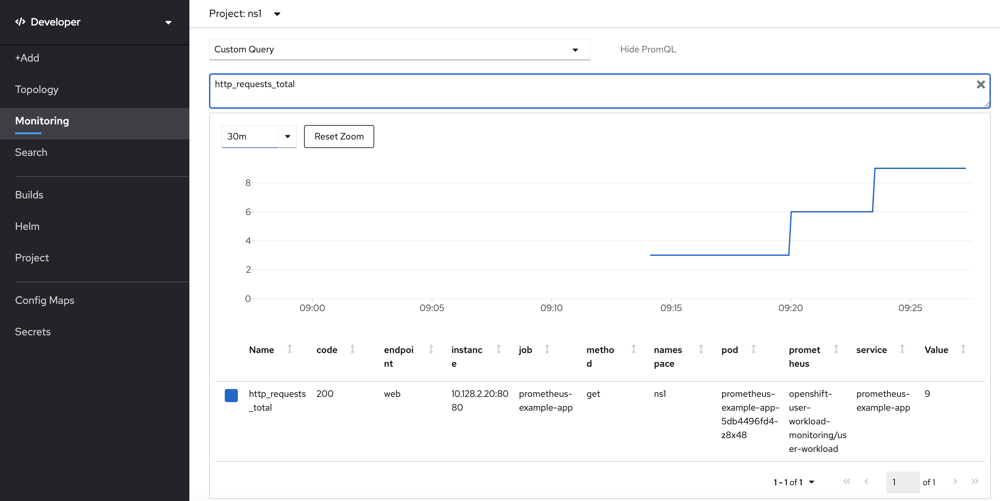
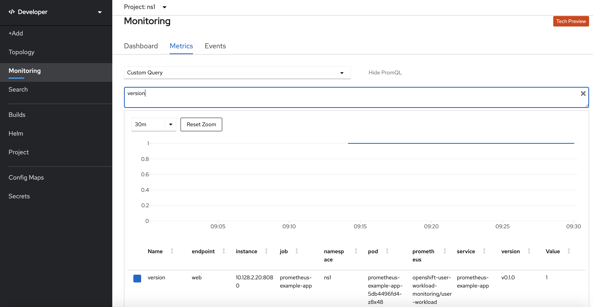
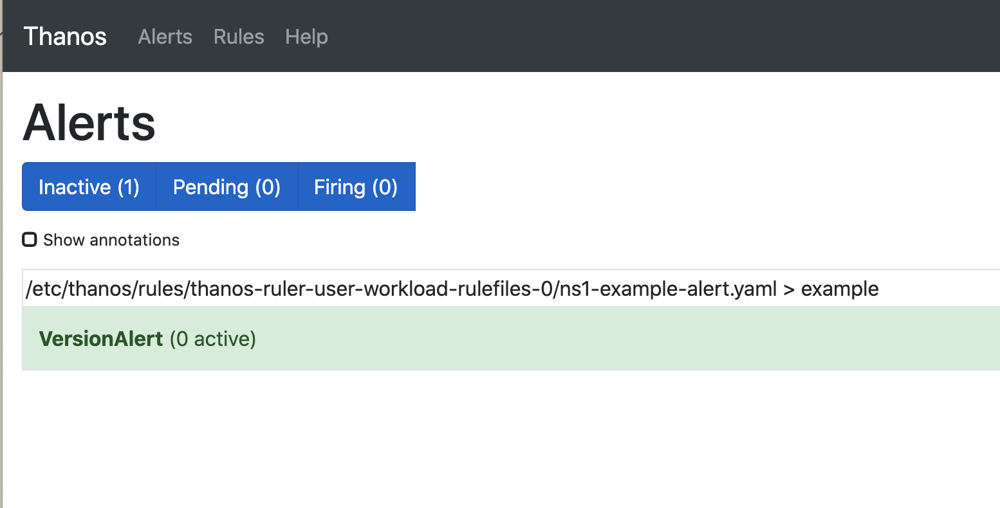
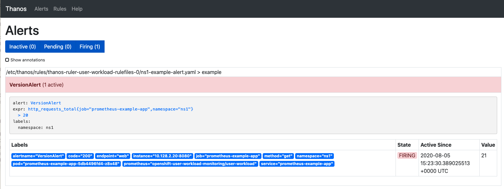

# User Workload Monitoring

## Enable User Workload Monitoring

In OCP 4.5 this is a tech preview feature. 

Cluster administrator should create a ConfigMap to enable it

```
% cat cluster-monitoring-config.yaml 

apiVersion: v1
kind: ConfigMap
metadata:
  name: cluster-monitoring-config
  namespace: openshift-monitoring
data:
  config.yaml: |
    techPreviewUserWorkload:
      enabled: true
```

```
 % oc create -f cluster-monitoring-config.yaml

configmap/cluster-monitoring-config created

```

## Create a namespace to deploy an application

As a regular user

` oc new-project ns1`

## Provide access to user(s) on a namespace

Cluster administrator to add following roles to user(s). Each of these rolebindings can be created for different users, but here I am doing it for one user.

```
oc policy add-role-to-user monitoring-rules-view UserName -n ns1
```

```
oc policy add-role-to-user monitoring-rules-edit UserName -n ns1
```

```
oc policy add-role-to-user monitoring-edit UserName -n ns1
```

## Deploy an application

The application should have been instrumented to expose metrics using prometheus standards. The following deployment is for one such sample application.

```
% cat prometheus-example-app.yaml 
apiVersion: apps/v1
kind: Deployment
metadata:
  labels:
    app: prometheus-example-app
  name: prometheus-example-app
  namespace: ns1
spec:
  replicas: 1
  selector:
    matchLabels:
      app: prometheus-example-app
  template:
    metadata:
      labels:
        app: prometheus-example-app
    spec:
      containers:
      - image: quay.io/brancz/prometheus-example-app:v0.2.0
        imagePullPolicy: IfNotPresent
        name: prometheus-example-app
---
apiVersion: v1
kind: Service
metadata:
  labels:
    app: prometheus-example-app
  name: prometheus-example-app
  namespace: ns1
spec:
  ports:
  - port: 8080
    protocol: TCP
    targetPort: 8080
    name: web
  selector:
    app: prometheus-example-app
  type: ClusterIP
```

* Create this application deployment and service as a regular user. This will create a deployment for a containerized application ie., `quay.io/brancz/prometheus-example-app:v0.2.0` and add a service for the same.

```
% oc create -f prometheus-example-app.yaml 

deployment.apps/prometheus-example-app created
service/prometheus-example-app created
```

* Create a route by exposing the service

```
% oc expose svc prometheus-example-app
route.route.openshift.io/prometheus-example-app exposed
```
* Wait until the application pod is running
```
  % oc get po

NAME                                      READY   STATUS    RESTARTS   AGE
prometheus-example-app-5db4496fd4-5gwrr   1/1     Running   0          2m15s
```

Get your application URL and curl for metrics exposed by the application

```
% export URL=$(oc get route | awk 'NR>1 {print $2}')
% curl $URL/metrics
# HELP http_requests_total Count of all HTTP requests
# TYPE http_requests_total counter
http_requests_total{code="200",method="get"} 3
# HELP version Version information about this binary
# TYPE version gauge
version{version="v0.1.0"} 1
```


## Configure Prometheus to scrape metrics 

* Create a ServiceMonitor to scrape metrics from the application

```
% cat prometheus-example-monitor.yaml
apiVersion: monitoring.coreos.com/v1
kind: ServiceMonitor
metadata:
  labels:
    k8s-app: prometheus-example-monitor
  name: prometheus-example-monitor
  namespace: ns1
spec:
  endpoints:
  - interval: 30s
    port: web
    scheme: http
  selector:
    matchLabels:
      app: prometheus-example-app
```

```
% oc create -f prometheus-example-monitor.yaml

servicemonitor.monitoring.coreos.com/prometheus-example-monitor created
```

* Verify
  
```
% oc -n ns1 get servicemonitor
NAME                         AGE
prometheus-example-monitor   4m2s
```

## Add an Alert 


* Add an alert based on the metric being scraped. The alert below will fire when number of http requests hitting the service cross 20. 
  
```
% cat example-alert.yaml
apiVersion: monitoring.coreos.com/v1
kind: PrometheusRule
metadata:
  name: example-alert
  namespace: ns1
spec:
  groups:
  - name: example
    rules:
    - alert: VersionAlert
      expr: http_requests_total{job="prometheus-example-app"} > 20
```

```
% oc create -f example-alert.yaml 
prometheusrule.monitoring.coreos.com/example-alert created
```

* Verify
  
```
% oc get PrometheusRule
NAME            AGE
example-alert   52s
```

## Test the user workload metrics captured by Prometheus

Navigate to Developer Console  -> Monitoring -> Metrics Tab and search with a `Custom Query` for the two metrics `http_requests_total` and `version`

The results will be shown as below.




## Verify the Alert firing

Administrator can view the alerts. Cluster administrator can capture Thanos URL running

`oc get route -n openshift-user-workload-monitoring`

Type in this URL in the browser and login with cluster admin credentials

You will notice no alerts are firing yet.


Now curl the application URL a few times until it crosses 20.
`curl $URL/metrics`

As soon as the output shows total requests as 21

```
# HELP http_requests_total Count of all HTTP requests
# TYPE http_requests_total counter
http_requests_total{code="200",method="get"} 21
# HELP version Version information about this binary
# TYPE version gauge
version{version="v0.1.0"} 1
```

you will see the alert firing as below.




